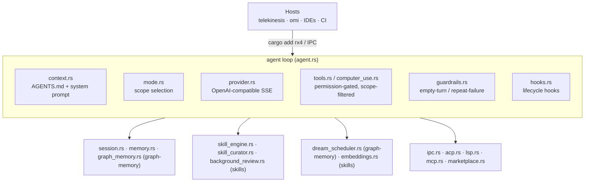
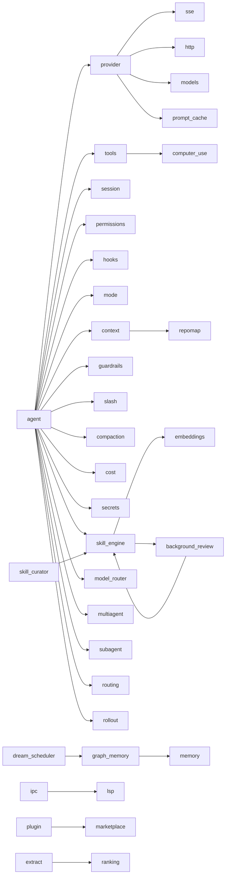
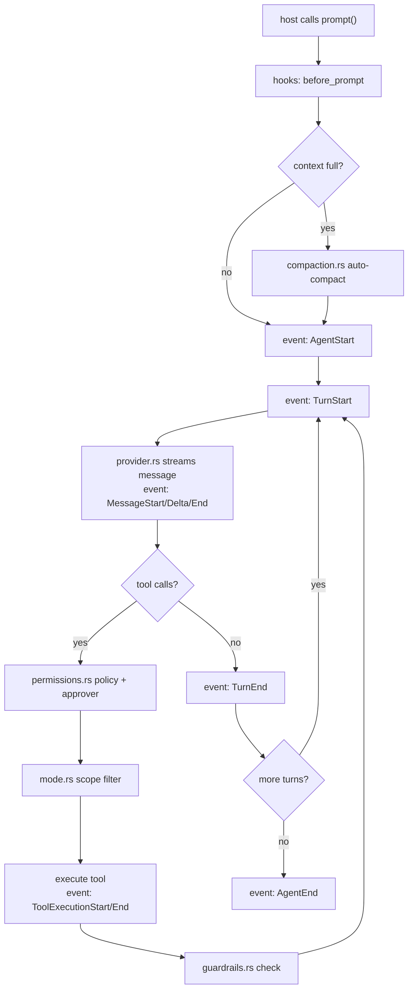
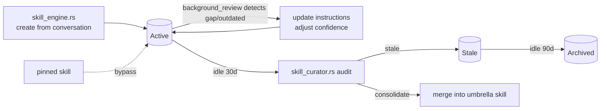
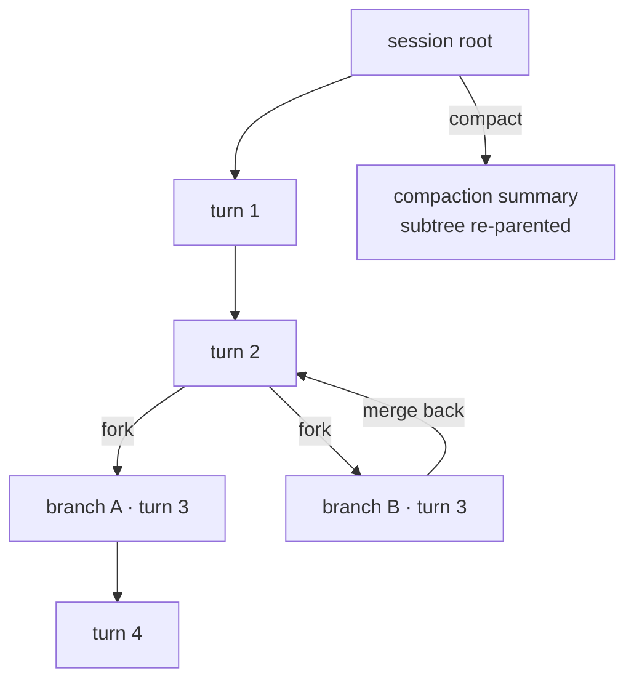
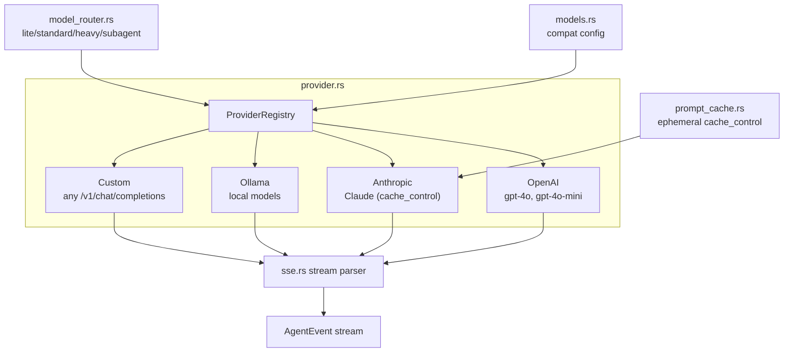

# rotary (rx4) — agent harness engine

All responses must be in English.

## Position

rotary is a **pure agent harness engine**. It owns the agent loop, tools,
providers, sessions, permissions, computer-use, and IPC. It contains **no
product UI**, **no scheduling policy**, and **no pi protocol compat** (that
moved to the host — telekinesis).

Hosts (telekinesis CLI/TUI, omi desktop, IDEs, CI) embed it via
`cargo add rx4` or connect to `rotary serve` over JSON-RPC IPC.

**Key principle: rotary exposes CAPABILITIES, not POLICY.** Scheduling,
enabled flags, and lifecycle decisions are the host's job. Modules like
`dream_scheduler` and `skill_curator` provide the *capability* to run a
cycle or audit; the host decides *when*.

## Stack

- Rust 2021 (MSRV 1.88), `#![forbid(unsafe_code)]`
- tokio (async runtime, feature-gated)
- serde / serde_json
- rs_peekaboo 0.3.2 (crates.io, computer-use, feature-gated)
- reqwest (providers, feature-gated)
- MPL-2.0

## Architecture



## Module dependency graph



## Modules

| File | Responsibility |
|---|---|
| `agent.rs` | event-driven loop, tool registry, streaming, JoinSet parallel tool batches |
| `provider.rs` | multi-provider OpenAI-compatible client, HTTP connection prewarm |
| `tools.rs` | built-in FS/shell/find tools (7) |
| `session.rs` | session tree (fork/merge) + JSONL persistence |
| `permissions.rs` | policy pattern, allow/deny, host approver |
| `hooks.rs` | lifecycle hooks |
| `mode.rs` | scopes (coding/research/plan/ask/computer_use) |
| `context.rs` | AGENTS.md loading, system prompt assembly |
| `slash.rs` | slash command parser |
| `guardrails.rs` | empty-turn detection, repeated-failure detection |
| `extract.rs` | structured extraction (JSON contracts) |
| `ranking.rs` | proactive ranking |
| `computer_use.rs` | rs_peekaboo native integration (no FFI), 13 `cu_*` tools |
| `ipc.rs` | Unix socket JSON-RPC server |
| `config.rs` | config file + env |
| `plugin.rs` | plugin registry |
| `acp.rs` | ACP host |
| `lsp.rs` | LSP manager (diagnostics, references, definition) |
| `skill_engine.rs` | skill engine (Beta-Binomial confidence, keyword/semantic activate) — `skills` feature |
| `background_review.rs` | background review loop — heuristic learning signals from turns — `skills` feature |
| `skill_curator.rs` | skill lifecycle curator — Active→Stale→Archived, consolidation — `skills` feature |
| `dream_scheduler.rs` | dream cycle runner — graph consolidation capability (host schedules) — `graph-memory` feature |
| `embeddings.rs` | vector embeddings for semantic skill matching (Gemini / Ollama) — `skills` feature |
| `graph_memory.rs` | knowledge graph (pagerank, community detection, dream consolidation) — `graph-memory` feature |
| `memory.rs` | SQLite persistent memory store |
| `compaction.rs` | context compaction (auto-compact) |
| `cost.rs` | cost tracking (per-model pricing) |
| `secrets.rs` | secret redaction (pattern-based) |
| `sse.rs` | SSE stream parser |
| `marketplace.rs` | plugin marketplace index + installer |
| `http.rs` | reqwest HTTP client (providers feature) |
| `mcp.rs` | MCP client (JSON-RPC 2.0 over stdio) |
| `model_router.rs` | tiered model routing (lite/standard/heavy/subagent) |
| `models.rs` | model registry + compat config |
| `multiagent.rs` | multi-agent coordination (coordinator/worker/reviewer/researcher) |
| `prompt_cache.rs` | Anthropic ephemeral cache_control (auto on Anthropic provider stream) |
| `repomap.rs` | pagerank-ranked symbol extraction (host API) |
| `rollout.rs` | rollout tracking + trace writer (host API) |
| `routing.rs` | smart routing (host API; not auto inside Agent loop) |
| `sandbox.rs` | userspace SandboxManager + optional OsSandboxRunner (seatbelt/bwrap) |
| `subagent.rs` | subagent management (git worktree isolation) |

Host opt-in on `Agent` (0.3.5+): `set_skill_registry`, `set_graph_memory`,
`enable_os_sandbox` / `set_os_sandbox`, `set_sandbox`. Model router / multiagent
/ cost are library APIs — hosts choose when to call them. |

## Agent loop



## Skill lifecycle



## Session tree



## Provider abstraction



## Feature flags

| Feature | Default | Enables |
|---|---|---|
| `ipc` | yes | tokio runtime, Unix socket JSON-RPC server, LSP client |
| `builtin-tools` | yes | read/write/edit/bash/grep/find/ls with rayon parallel search |
| `computer-use` | no | rs_peekaboo `cu_*` tools (13 tools) |
| `providers` | no | reqwest SSE streaming for OpenAI/Anthropic/Ollama/custom |
| `memory` | no | SQLite-backed memory store |
| `mcp` | no | MCP client (rmcp, JSON-RPC 2.0 over stdio) |
| `sqlite-sessions` | no | SQLite session persistence |
| `skills` | no | skill engine, skill curator, background review, embeddings (serde_yaml + dirs) |
| `graph-memory` | no | graph memory (pagerank, community detection), dream scheduler |

> `pi-compat` and `pi-extensions` have been **removed** — pi protocol
> compatibility (JSONL v3 sessions, RPC, extensions, QuickJS) now lives in
> the host (telekinesis).

## Rules

- No hard-coded API keys, no telemetry.
- New agent features land in rotary first, then surface to hosts via IPC/slash.
- computer-use uses the crates.io `rs_peekaboo` dependency — no vendoring, no FFI.
- A scope is a work mode, not an agent name.
- rotary exposes capabilities, not policy — scheduling and lifecycle decisions belong to the host.
- Keep MPL-2.0.

## Validation

```bash
cargo build
cargo build --all-features
cargo test --all-features
cargo clippy --all-features
cargo fmt --check
```

## Commits

English Conventional Commits, e.g. `feat(agent): stream tool call deltas`.
