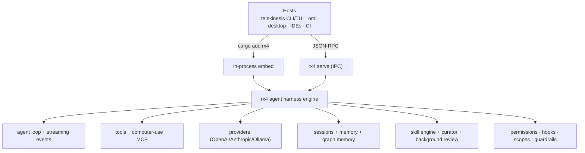
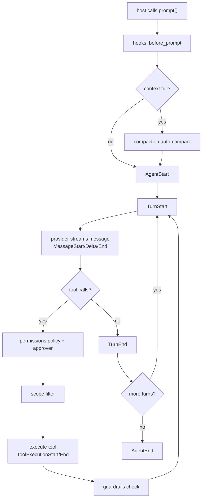
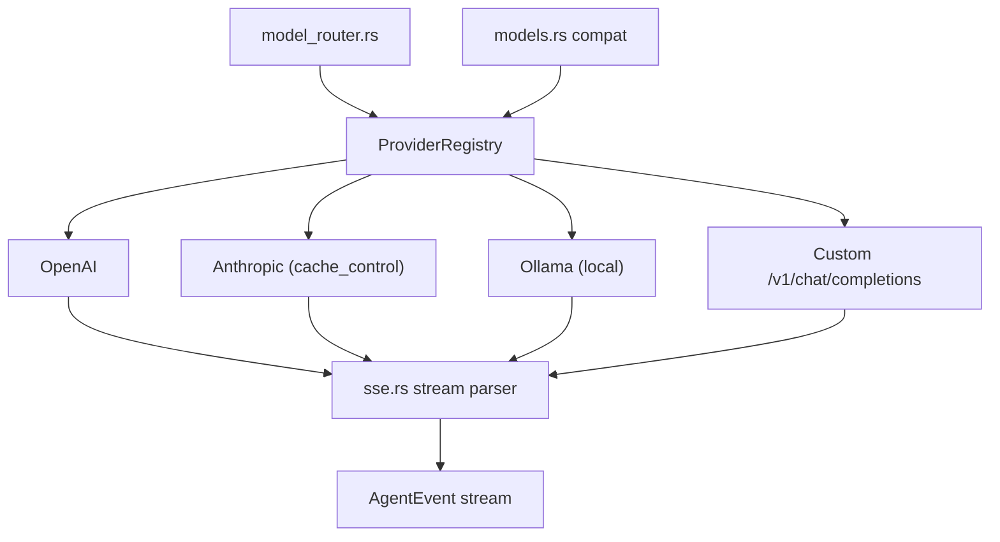

# rotary (rx4) — the agent harness engine

[](https://crates.io/crates/rx4)
[](LICENSE)
[](https://blog.rust-lang.org/2025/06/26/Rust-1.88.0.html)

Pure agent harness engine. Models write; rotary gives them tools, memory,
loops, permissions, sessions, and control planes. **No product UI, no
scheduling policy, no pi protocol** — hosts own those.

rotary exposes **capabilities, not policy**. Scheduling, enabled flags, and
lifecycle decisions are the host's job.

## Architecture



## Install

```toml
[dependencies]
rx4 = { version = "0.3", features = ["ipc", "builtin-tools", "providers", "computer-use"] }
```

Or via the CLI:

```bash
cargo add rx4 --features ipc,builtin-tools,providers,computer-use
```

## Quick start

```rust
use rx4::{Agent, Scope, ToolRegistry, register_builtin_tools};

#[tokio::main]
async fn main() -> Result<(), Box<dyn std::error::Error>> {
    let mut agent = Agent::new();
    let mut tools = ToolRegistry::new();
    register_builtin_tools(&mut tools);
    agent.set_tools(tools);
    agent.set_scope(Scope::Coding);
    agent.prompt("fix the failing test").await?;
    Ok(())
}
```

## IPC server

```bash
rx4 serve /tmp/rx4.sock
```

JSON-RPC methods: `ping`, `state`, `prompt`, `set_model`, `tools`,
`plugins`, `messages`, `session_list`, `session_clear`.

> `rx4 serve` starts the Unix socket JSON-RPC server. Hosts connect to
> the socket and drive the agent loop remotely — the host never owns agent
> logic.

## Agent loop



## Features

- **Agent loop with streaming events** — 11 event types (`AgentStart`,
  `TurnStart`, `MessageStart`, `MessageDelta`, `MessageEnd`, `ToolCall`,
  `ToolExecutionStart`, `ToolExecutionEnd`, `TurnEnd`, `AgentEnd`, `Error`).
- **5 scopes** — `coding`, `research`, `plan`, `ask`, `computer_use`.
- **7 builtin tools** — `read`, `write`, `edit`, `bash`, `grep`, `find`, `ls`
  (rayon parallel search).
- **13 computer-use tools** (`cu_*`) via
  [rs_peekaboo](https://crates.io/crates/rs_peekaboo) — native Rust, no FFI.
- **MCP client** — JSON-RPC 2.0 over stdio; tools prefixed
  `mcp__{server}__{tool}`.
- **Session tree** — fork/merge with JSONL persistence; optional SQLite via
  `sqlite-sessions` (`save_sqlite` / `load_sqlite`).
- **Permission system** — `Policy` + `Approver`; default mode is
  `workspace_write` (process tools require approval).
- **Lifecycle hooks** — pluggable hook registry around the agent loop.
- **Context compaction** — token-estimate auto-compact via
  `estimate_messages` + `apply_compaction`.
- **Parallel tool batches** — `JoinSet` for Read/Network; Write/Process serial.
- **Skill engine** (`skills`) — Beta-Binomial confidence; keyword + optional
  embedding activation. Host opt-in: `Agent::set_skill_registry` injects
  matching skill instructions into the system prompt each turn.
- **Background review** (`skills`) — heuristic learning signals; host calls
  `BackgroundReviewer` (not auto-scheduled).
- **Skill curator** (`skills`) — Active→Stale→Archived; host schedules audits.
- **Embeddings** (`skills` + `providers`) — Gemini / Ollama semantic matching.
- **Graph memory** (`graph-memory`) — pagerank + community detection. Host
  opt-in: `Agent::set_graph_memory` extracts nodes/edges after each run.
- **Dream scheduler** (`graph-memory`) — consolidation capability (host runs).
- **Model router / multi-agent / cost / repo map / rollout** — library APIs for
  hosts; not auto-selected inside `Agent::prompt`.
- **Secret redaction** — pattern-based redaction applied to tool results.
- **Prompt caching** — Anthropic `cache_control` applied automatically on
  `OpenAIProvider` stream bodies when `provider_id == "anthropic"`.
- **OS sandbox** — optional seatbelt/bwrap wrap for bash via
  `Agent::enable_os_sandbox` (userspace `SandboxManager` still separate).
- **Slash command parsing** — `/command` parsing for host UIs.
- **Guardrails** — empty turn detection, repeated failure detection, tool-effect
  batch planning.
- **Structured extraction** — JSON contracts for typed tool outputs.
- **Subagent manager** — optional provider-driven `Agent::prompt` runs with
  workspace isolation directories.
- **LSP client** — diagnostics, references, definition via Language Server Protocol.
- **ACP host** — JSON-RPC session/prompt surface over an embedded agent.
- **Plugin registry + marketplace** — install with required sha256, blocklist,
  sanitized names; registry loads installed plugins.

### Scopes

| Scope | Tools | Policy |
|---|---|---|
| `coding` | FS + shell + find | workspace_write |
| `research` | read-only | read_only |
| `plan` | read-only | read_only |
| `ask` | none | deny_all |
| `computer_use` | rs_peekaboo `cu_*` | full_access |

## Feature flags

| Feature | Default | Enables |
|---|---|---|
| `ipc` | yes | tokio runtime, Unix socket JSON-RPC server, LSP client |
| `builtin-tools` | yes | read/write/edit/bash/grep/find/ls with rayon parallel search |
| `computer-use` | no | rs_peekaboo `cu_*` tools (13 tools) |
| `providers` | no | reqwest SSE streaming for OpenAI/Anthropic/Ollama/custom |
| `memory` | no | SQLite-backed memory store |
| `mcp` | no | MCP client (rmcp, JSON-RPC 2.0 over stdio) |
| `sqlite-sessions` | no | SQLite session save/load on `Session` |
| `skills` | no | skill engine, curator, background review, embeddings |
| `graph-memory` | no | graph memory, dream scheduler |

> `pi-compat` and `pi-extensions` have been **removed** — pi protocol
> compatibility now lives in the host (telekinesis).

## Providers

rotary ships a provider abstraction over OpenAI-compatible chat completions
endpoints:

- **OpenAI** — `gpt-4o`, `gpt-4o-mini`, etc.
- **Anthropic** — Claude models via the Anthropic API.
- **Ollama** — local models via `http://localhost:11434`.
- **Custom OpenAI-compatible endpoints** — any server implementing the
  `/v1/chat/completions` schema.



Use `with_base_url` to point at a custom endpoint:

```rust
use rx4::provider::ProviderRegistry;

let mut registry = ProviderRegistry::new();
registry.register("custom", "my-model", "sk-...")
    .with_base_url("https://my-llm.example.com/v1");
```

## Computer-use

Powered by [rs_peekaboo](https://crates.io/crates/rs_peekaboo) — native
Rust, no FFI:

```toml
rx4 = { version = "0.3", features = ["computer-use"] }
```

13 tools:

| Tool | Description |
|---|---|
| `cu_call` | Invoke a named application method or open a target |
| `cu_see` | Capture a screenshot / visual snapshot of the screen |
| `cu_image` | Encode or transform an image for model input |
| `cu_click` | Click at screen coordinates |
| `cu_type` | Type text into the focused element |
| `cu_hotkey` | Press a keyboard hotkey / key combination |
| `cu_scroll` | Scroll at coordinates or in the focused element |
| `cu_window` | Focus, move, resize, or close a window |
| `cu_app` | Launch or switch to an application |
| `cu_list` | List open windows or running applications |
| `cu_open` | Open a file or URL in the default handler |
| `cu_clipboard` | Read from or write to the system clipboard |
| `cu_doctor` | Diagnose computer-use environment and permissions |

## Events

The agent loop emits 11 streaming event types:

| Event | Description |
|---|---|
| `AgentStart` | The agent loop has started |
| `TurnStart` | A new turn has begun (with turn index) |
| `MessageStart` | A message has started streaming (with role) |
| `MessageDelta` | A streaming text delta |
| `MessageEnd` | A message has finished (with role and full content) |
| `ToolCall` | The model requested a tool call |
| `ToolExecutionStart` | Tool execution has begun |
| `ToolExecutionEnd` | Tool execution has finished (with result) |
| `TurnEnd` | A turn has ended (with turn index) |
| `AgentEnd` | The agent loop has finished |
| `Error` | An error occurred (with message) |

## Hosts

Current hosts built on rotary:

- **[telekinesis](https://github.com/tschk/telekinesis)** — CLI/TUI product
  on top of rotary. Owns pi protocol compat.
- **omi desktop** — desktop application embedding rotary.

See [docs/HOSTS.md](docs/HOSTS.md) for the hosting guide.

See [docs/README.md](docs/README.md) for the documentation index and command contract.

## License

MPL-2.0
