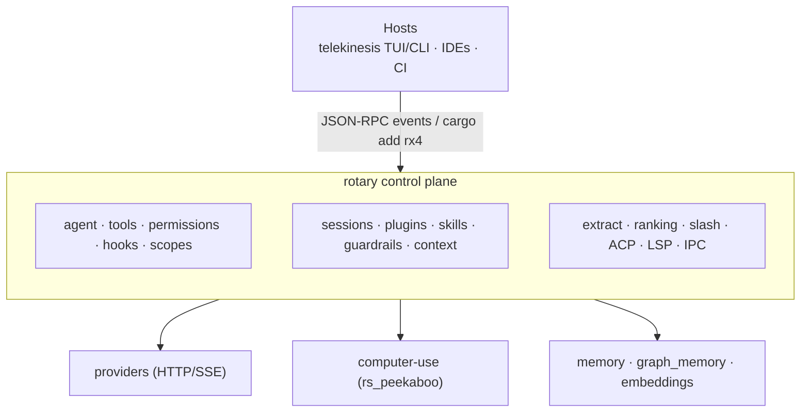

# rotary — agent harness engine

## Mission

Be the best **general-purpose coding agent harness**: embeddable, light,
extensible, protocol-friendly. Product shells live elsewhere (telekinesis).

rotary exposes **capabilities, not policy**. Scheduling, enabled flags, and
lifecycle decisions are the host's job.

## Layers



## Influences (feature adoption)

| Project | Adopted in rotary |
|---|---|
| **Codex** | sandbox/approvals → `permissions`; non-interactive headless; skills pattern; bounded tool loops |
| **OpenCode** | multi-provider routing; session resume; plugin/tool surface |
| **t3code** | typed event boundary; thin host protocol over IPC |
| **pi / Crush** | event lifecycle; SKILL.md; hook envelopes |
| **rs_peekaboo** | embedded computer-use primitives |
| **Hermes Agent** | self-improving learning loop → `background_review`, `skill_curator` |
| **Unthinkclaw** | embeddings module → `embeddings` |

## Core contracts

### Agent loop

```mermaid
flowchart TD
  before["before_prompt"] --> compact{"auto-compact?"}
  compact -->|yes| ac["compaction"]
  compact -->|no| start["agent_start"]
  ac --> start
  start --> turn["turn_start"]
  turn --> msg["message stream"]
  msg --> tools["tool loop<br/>(permission-gated, scope-filtered)"]
  tools --> after["after_turn"]
  after --> more{"more turns?"}
  more -->|yes| turn
  more -->|no| end["agent_end"]
```

### Scopes

Work **scopes** (not named product agents): `coding` | `research` | `plan` |
`ask` | `computer_use`.

### Permissions

`full_access` | `read_only` | `workspace_write` | `deny_all` + allow/deny
lists + host approver.

### Events

Tagged union pushed to subscribers and mirrored as IPC notifications
(`method: "event"`). Hosts must treat events as the UI boundary (t3code
pattern).

### Capability vs policy

Modules like `dream_scheduler` and `skill_curator` expose the *capability*
to run a consolidation cycle or audit skills. The host decides *when* to
invoke them — rotary never schedules on its own.

## Versioning

Semver for library API. Bump minor for new modules/tools; patch for harness
fixes. Hosts pin `rx4` versions via Cargo.
