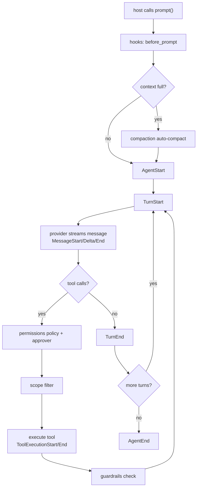

# Agent loop and events

The host calls `prompt()`. The loop streams typed events to subscribers. A temporary IPC adapter may mirror events as (`method: "event"`), but hosts must treat the typed event stream as the UI boundary.

## Core loop events

| Event | Description |
|---|---|
| `AgentStart` | The agent loop has started |
| `TurnStart` | A new turn has begun (with turn index) |
| `MessageStart` | A message has started streaming (with role) |
| `MessageDelta` | A streaming text delta |
| `MessageEnd` | A message has finished (with role and full content) |
| `ToolCall` | The model requested a tool call |
| `ToolExecutionStart` | Tool execution has begun |
| `ToolExecutionEnd` | Tool execution has finished (with result) |
| `TurnEnd` | A turn has ended (with turn index). Retained so existing host matches still compile; the loop emits `TurnEnded`. |
| `TurnEnded` | The one turn-complete event. Hosts that implement auto-continue policy read `metadata`. |
| `AgentEnd` | The agent loop has finished |
| `Error` | An error occurred (with message) |

## Additional events

| Event | Description |
|---|---|
| `ContextUsage` | Token window occupancy and auto-compact threshold |
| `Usage` | Provider token usage for a request (`estimated` when inferred) |
| `CompactionStart` / `CompactionEnd` | Context compaction began or finished |
| `SkillActivated` | A skill was injected into the system prompt |
| `ToolSource` | Provenance of a tool (builtin, MCP, plugin, computer-use) |
| `ApprovalRequired` | Tool needs host approval (`ApprovalRequest`) |
| `PlanProposed` / `PlanDecided` | Whole-turn plan approval and the host's answer |
| `GuardrailWarning` / `GuardrailStop` | Loop detection warned or ended the turn |
| `SelfHealing` | A failing turn is being re-prompted with error context |
| `TodoUpdated` | Opt-in engine todo list changed |
| `CacheAudit` | Prompt-cache stability report for one provider request |
| `GateResult` | Opt-in workspace quality gate result |
| `MemoryRecalled` | Semantic graph memories selected for this prompt |
| `BudgetExceeded` | A host-configured budget stopped the loop |
