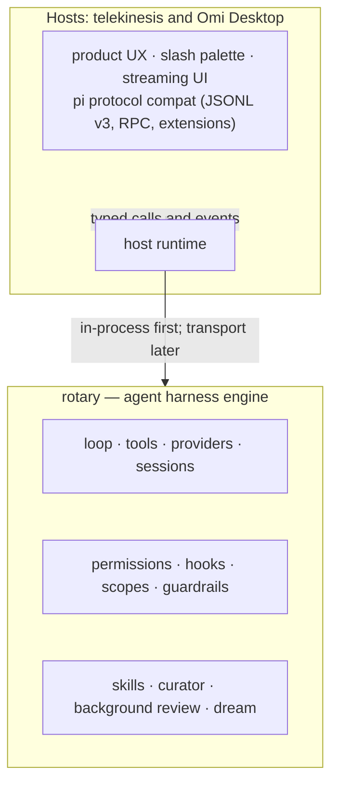

# Hosting the rotary harness engine

## Architecture split



## telekinesis

Primary host. One CLI, one TUI.

```bash
tk                          # launch the telekinesis TUI
```

Wire:

- `rx4` is a published Cargo dependency, not a submodule.
- `ui/tui/src/main.rs` currently imports rx4 directly and drives the agent loop
  in-process via tokio channels.
- builtin tools + computer-use tools are registered at startup.
- pi protocol compat (JSONL v3 sessions, RPC, extensions, QuickJS) is owned
  by telekinesis, not rotary.

## Embedding as a library

```rust
use rx4::{Agent, Scope, ToolRegistry, register_builtin_tools};

let mut agent = Agent::new();
let mut tools = ToolRegistry::new();
register_builtin_tools(&mut tools);
agent.set_tools(tools);
agent.set_scope(Scope::Coding);
```

The existing `rx4 serve` surface remains a compatibility adapter during the
boundary migration. New host surfaces should use telekinesis `HostRuntime`.

## Computer-use

Do **not** shell out to Praefectus. Embed it through rx4's `computer-use`
feature:

Enable the `computer-use` feature when adding rx4.

```rust
rx4::computer_use::register_tools(&mut tools);
```

This registers the 13 `cu_*` tools with no FFI through the native Rust
Praefectus crate from crates.io.
