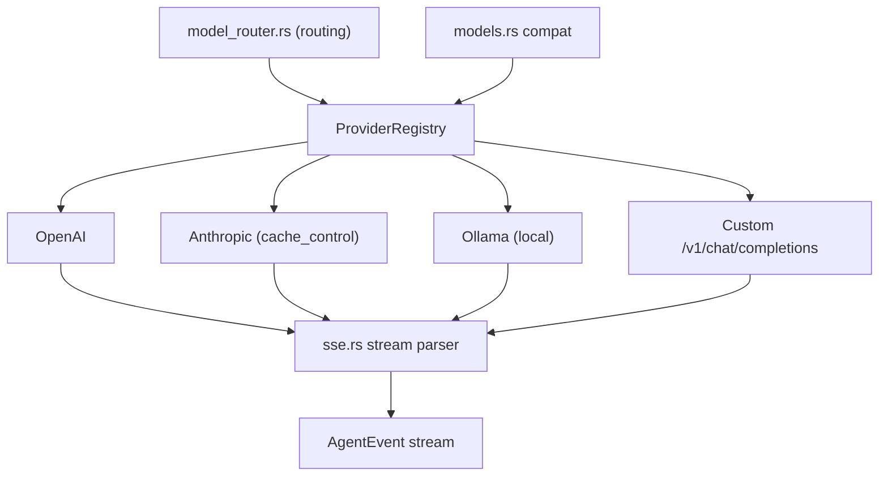

# Providers

rotary ships a provider abstraction over OpenAI-compatible chat completions endpoints:

- **OpenAI** — `gpt-4o`, `gpt-4o-mini`, etc.
- **Anthropic** — Claude models via the Anthropic API.
- **Ollama** — local models via `http://localhost:11434`.
- **Custom OpenAI-compatible endpoints** — any server implementing the `/v1/chat/completions` schema.



Enable the `providers` feature. Use `with_base_url` to point at a custom endpoint:

```rust
use rx4::provider::ProviderRegistry;

let mut registry = ProviderRegistry::new();
registry.register("custom", "my-model", "sk-...")
    .with_base_url("https://my-llm.example.com/v1");
```

Anthropic `cache_control` is applied automatically on `OpenAIProvider` stream bodies when `provider_id == "anthropic"`. Provider usage is surfaced through `Event::Usage` and `Agent::cache_stats()`. Hosts that reimplement `Provider` (for example a custom SSE client) must call `apply_cache_control` themselves.
