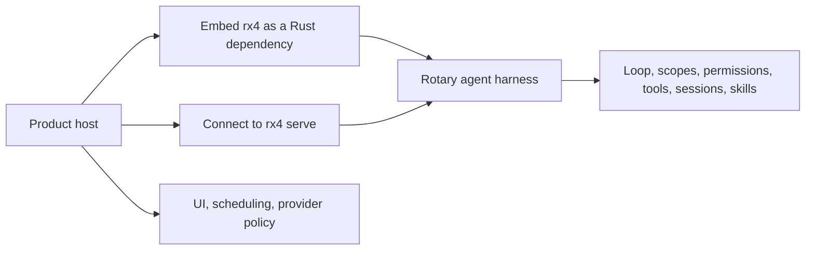

# Rotary documentation

Rotary is the product name for the MPL-2.0 agent harness crate and CLI. The Rust crate and executable are both named `rx4`; use `rx4`, not `rotary`, in terminal commands.



## Guides

- [Architecture](ARCHITECTURE.md) — module and agent-loop contracts.
- [Hosts](HOSTS.md) — embedding and IPC integration boundaries.
- [Comparison](COMPARISON.md) — scope relative to other harnesses.
- [Roadmap](ROADMAP.md) — completed capabilities and near-term work.

## Command contract

```bash
rx4 chat
rx4 exec "fix the failing test"
rx4 serve /tmp/rx4.sock
rx4 doctor
rx4 models
rx4 tools
```

Product hosts own scheduling and user experience. telekinesis owns pi protocol compatibility; Omi Desktop owns its desktop UI, local data policy, and provider-specific OAuth path.
