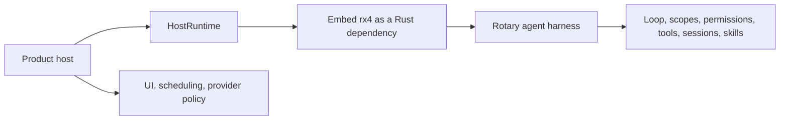

# Rotary documentation

Rotary is the product name for the MPL-2.0 agent harness crate and CLI. The Rust crate and executable are both named `rx4`; use `rx4`, not `rotary`, in terminal commands.

```mermaid
flowchart LR
  Host["Product host"] --> Runtime["HostRuntime"]
  Runtime --> Embed["Embed rx4 as a Rust dependency"]
  Embed --> Engine["Rotary agent harness"]
  Engine --> Capabilities["Loop, scopes, permissions, tools, sessions, skills"]
  Host --> Policy["UI, scheduling, provider policy"]
```

## Guides

- [Install](INSTALL.md) — `cargo add` / `cargo install`, CLI commands, Homebrew.
- [Features and flags](FEATURES.md) — capabilities, scopes, Cargo feature table.
- [Providers](PROVIDERS.md) — OpenAI / Anthropic / Ollama / custom endpoints.
- [Computer-use](COMPUTER-USE.md) — Praefectus `cu_*` tools.
- [Events](EVENTS.md) — agent loop and streaming event types.
- [Architecture](ARCHITECTURE.md) — module and agent-loop contracts.
- [Hosts](HOSTS.md) — embedding, IPC adapter, telekinesis / apollo.
- [Autoresearch](AUTORESEARCH.md) — host-driven optimization controller.
- [Boundary ADR](https://github.com/semitechnological/telekinesis/blob/main/docs/ADR-001-rotary-engine-telekinesis-host.md) — rotary engine and telekinesis host ownership.
- [Comparison](COMPARISON.md) — scope relative to other harnesses.
- [Roadmap](ROADMAP.md) — completed capabilities and near-term work.
- [Accuracy bench](BENCH.md) — SWE-bench Verified resolve rate (Codex / Pi / tk).

## Command contract

See [INSTALL.md](INSTALL.md). Product hosts own scheduling and user experience. telekinesis owns pi protocol compatibility; Omi Desktop owns its desktop UI, local data policy, and provider-specific OAuth path.
