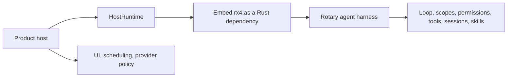

# Rotary documentation

Rotary is the product name for the MPL-2.0 agent harness crate and CLI. The Rust crate and executable are both named `rx4`; use `rx4`, not `rotary`, in terminal commands.


```mermaid
flowchart LR
  Host["Product host"] --> Runtime["HostRuntime"]
  Runtime --> Embed["Embed rx4 as a Rust dependency"]
  Embed --> Engine["Rotary agent harness"]
  Engine --> Capabilities["Loop, scopes, permissions, tools, sessions, skills"]
  Host --> Policy["UI, scheduling, provider policy"]
```

## Guides

- [Architecture](ARCHITECTURE.md) — module and agent-loop contracts.
- [Hosts](HOSTS.md) — embedding and compatibility-adapter boundaries.
- [Boundary ADR](https://github.com/semitechnological/telekinesis/blob/main/docs/ADR-001-rotary-engine-telekinesis-host.md) — rotary engine and telekinesis host ownership.
- [Comparison](COMPARISON.md) — scope relative to other harnesses.
- [Roadmap](ROADMAP.md) — completed capabilities and near-term work.

## Command contract

Install the CLI with the `cli` feature (required; a bare `cargo install rx4`
skips the binary). Homebrew `undivisible/homebrew-tap` `Formula/rx4.rb` must
add `cli` to its feature list or the bottle ships no binary.

```bash
cargo install rx4 --features cli,ipc,providers,builtin-tools,mcp
```

```bash
rx4 chat
rx4 exec "fix the failing test"
rx4 serve /tmp/rx4.sock
rx4 doctor
rx4 models
rx4 tools
```

Product hosts own scheduling and user experience. telekinesis owns pi protocol compatibility; Omi Desktop owns its desktop UI, local data policy, and provider-specific OAuth path.
